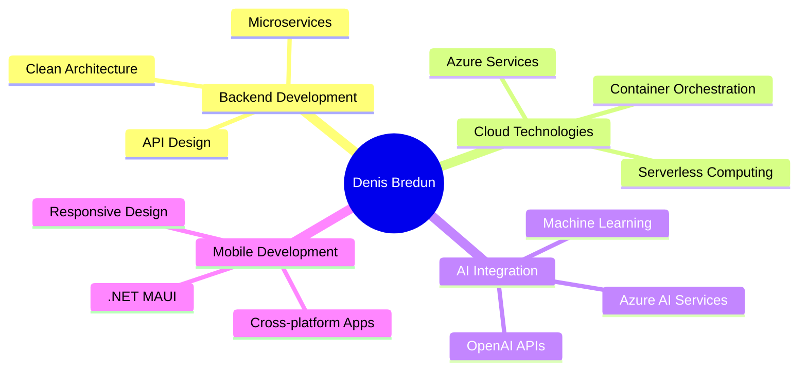

  

  
# 👨‍💻 Backend .NET Developer

  

---

## 🚀 Tech Arsenal

  
### 💻 Languages & Frameworks

### ☁️ Cloud & Database

### 🤖 AI & APIs

### 🛠️ Tools & DevOps

### 🧪 Testing

---

## 🏆 Featured Projects

  <table>
    <tr>
      <td width="50%">
        <h3 align="center">📱 Data Organizer (Client)</h3>
        

          
           
          
<strong>Cross-platform mobile app</strong> built with .NET MAUI. Real-time speech transcription with AI-powered summaries, cloud storage, and seamless user experience.

          

            
            
            
            
          

        

      </td>
      <td width="50%">
        <h3 align="center">☁️ Data Organizer Server</h3>
        

          
           
          
<strong>Backend API</strong> powering the mobile app. Azure AI integration for speech-to-text, OpenAI for summarization, secure data storage with Firebase.

          

            
            
            
            
          

        

      </td>
    </tr>
    <tr>
      <td width="50%">
        <h3 align="center">🎮 Kakuro Puzzle Game</h3>
        

          
           
          
<strong>WPF desktop application</strong> for Japan's classic number puzzle. Multiple difficulty levels, save/load functionality, and competitive leaderboard system.

          

            
            
            
            
          

        

      </td>
      <td width="50%">
        <h3 align="center">🌤️ Weather Subscription API</h3>
        

          
           
          
<strong>REST API</strong> for weather subscriptions with email notifications. Built during Software Engineering School 5.0 program.

          

            
            
            
            
          

          

            <a href="https://weather-subscription-api-h5i1.onrender.com" target="_blank">🔗 Live API</a> | 
            <a href="https://weather-subscription-api-h5i1.onrender.com/api/docs" target="_blank">📚 Documentation</a>
          

        

      </td>
    </tr>
  </table>

---

## 📊 GitHub Analytics

  
  

  

  

---

## 🎯 Current Focus

  

---

## 🤝 Let's Connect & Collaborate

  

---

  
### 💭 Developer Philosophy

*"Clean code is not written by following rules. It's written by following your passion."* — Uncle Bob

**Always learning, always building, always improving** 🚀

