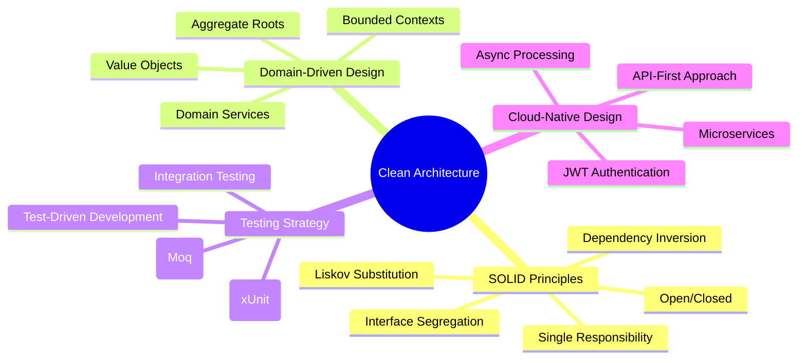

  

  
# 👨‍💻 Backend .NET Developer

  

📍 **Dnipro, Ukraine** (Open to Remote) | 🎓 **Junior Bachelor in Computer Science** | 🌍 **English: Upper-Intermediate (B2)**

---

## 🎯 Professional Summary

> **Backend .NET Developer** with a strong Computer Science foundation and hands-on experience building **scalable, cloud-native applications**. Focused on **clean architecture (SOLID, DDD)**, RESTful API design, and full-cycle development using **MAUI**, **Azure services**, and production-grade testing. Experienced with **CI/CD**, **Docker**, **JWT-based authentication**, async processing, and AI integration via **Azure AI** and **OpenAI APIs**.

---

## 🚀 Core Tech Stack

### 🏗️ .NET Ecosystem

### ☁️ Cloud & AI Services

### 🗄️ Databases & Storage

### 🛠️ DevOps & Testing

### 🌐 Additional Technologies

---

## 💼 Professional Experience & Projects

  <table>
    <tr>
      <td width="50%">
        <h3 align="center">🎯 Data Organizer - AI Mobile App</h3>
        

          
           
          
<strong>Dec 2024 – Apr 2025</strong>

          
AI-powered mobile app for <strong>voice transcription, summarization, and structured data management</strong>. Designed client-server architecture with Azure Speech API and OpenAI integration.

          
<strong>Key Achievements:</strong>

          <ul align="left">
            <li>✅ Released stable beta in under 3 months</li>
            <li>📈 Reduced transcription time by 2x through AI automation</li>
            <li>👥 Used by entrepreneurs and students for real-world audio processing</li>
          </ul>
          

            
            
            
            
          

        

      </td>
      <td width="50%">
        <h3 align="center">☁️ Data Organizer Server</h3>
        

          
           
          
<strong>Backend API</strong>

          
Robust <strong>ASP.NET Core Web API</strong> with Azure Speech API and OpenAI integration. Implements <strong>JWT-based authentication</strong>, async RESTful endpoints, and NoSQL data persistence with Firestore.

          
<strong>Architecture Highlights:</strong>

          <ul align="left">
            <li>🏗️ Clean Architecture with SOLID principles</li>
            <li>🔐 JWT-based authentication system</li>
            <li>🚀 Async processing for AI endpoints</li>
            <li>🐳 Docker containerization</li>
          </ul>
          

            
            
            
            
          

        

      </td>
    </tr>
    <tr>
      <td width="50%">
        <h3 align="center">🎮 Kakuro Puzzle Game</h3>
        

          
           
          
<strong>Sep – Nov 2024</strong>

          
<strong>WPF desktop application</strong> for Japan's classic number puzzle. Architected using <strong>MVVM pattern</strong> with complete game logic, leaderboards, and TDD approach.

          
<strong>Key Features:</strong>

          <ul align="left">
            <li>🏆 Fully functional leaderboards and data persistence</li>
            <li>🎨 Dark-themed UI with optimized grid rendering</li>
            <li>💾 JSON-based storage for game progress</li>
            <li>🧪 Complete unit test coverage with xUnit & Moq</li>
          </ul>
          

            
            
            
            
          

        

      </td>
      <td width="50%">
        <h3 align="center">🌤️ Weather Subscription API</h3>
        

          
           
          
<strong>May 2025</strong>

          
<strong>NestJS backend service</strong> for scheduled email-based weather alerts. Features email confirmation, unsubscribe flows, and automated PostgreSQL migrations.

          
<strong>Production Features:</strong>

          <ul align="left">
            <li>📧 Email confirmation & unsubscribe with unique tokens</li>
            <li>⏰ Cron-scheduled weather updates (hourly/daily)</li>
            <li>📚 Complete Swagger API documentation</li>
            <li>🚀 Live deployment with Docker on Render.com</li>
          </ul>
          

            
            
            
            
          

          

            <a href="https://weather-subscription-api-h5i1.onrender.com" target="_blank">🔗 Live API</a> | 
            <a href="https://weather-subscription-api-h5i1.onrender.com/api/docs" target="_blank">📚 Swagger Docs</a> |
            <a href="https://weather-subscription-api-h5i1.onrender.com/subscribe.html" target="_blank">📧 Subscribe Page</a>
          

        

      </td>
    </tr>
  </table>

### 🤖 Professional Internship Experience

  <h4>🎫 Telegram Bot for Departures - LLC "B.I.T." (Apr - May 2025)</h4>
  
<strong>Event-driven bot system</strong> automating ticket management via Telegram with GLPI integration

  
  **Key Achievements:**
  - 📈 **Reduced support response time by 17%** through automated ticket handling
  - 🔄 Streamlined business workflows, replacing manual forms with real-time bot interaction
  - 🎯 Successfully launched production-ready tool used by support staff in daily operations
  
  **Tech Stack:** GLPI API, Telegram Bot API, Flow XO, SendPulse, Apache, PHP, MySQL

---

## 📊 GitHub Analytics

  
  

  

---

## 🎯 Architecture & Development Philosophy

  

---

## 🎓 Education & Certifications

  
**🎓 Junior Bachelor's Degree in Computer Science**  
*Yevhen Paton Applied College of Welding and Electronics* | Sep 2021 – June 2025

**📚 Continuous Learning Focus:**
- Clean Architecture & SOLID Principles
- Domain-Driven Design (DDD)
- Cloud-Native Application Development
- AI Integration & API Design
- Test-Driven Development (TDD)

---

## 🤝 Let's Connect & Collaborate

  

**📍 Location:** Dnipro, Ukraine | **🌐 Remote-Ready** | **🗣️ English:** Upper-Intermediate (B2)

---

  
### 💭 Professional Mission

*"Building scalable, cloud-native applications with clean architecture and AI integration."*

**Passionate about backend engineering and eager to grow in a product-oriented .NET team** 🚀

